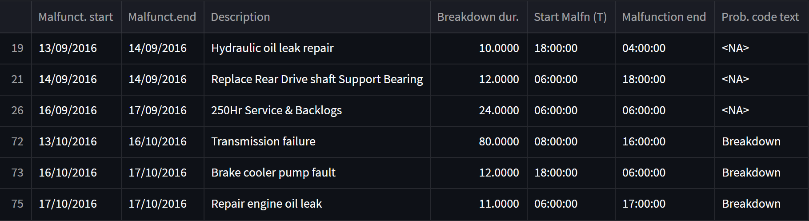
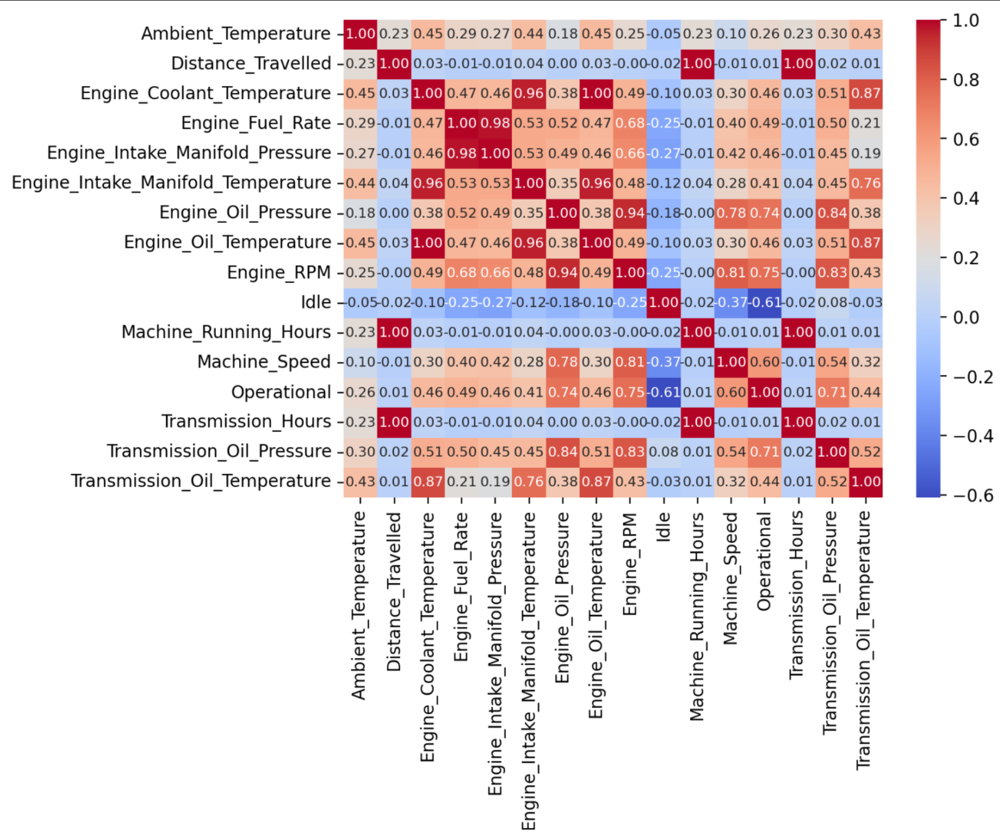
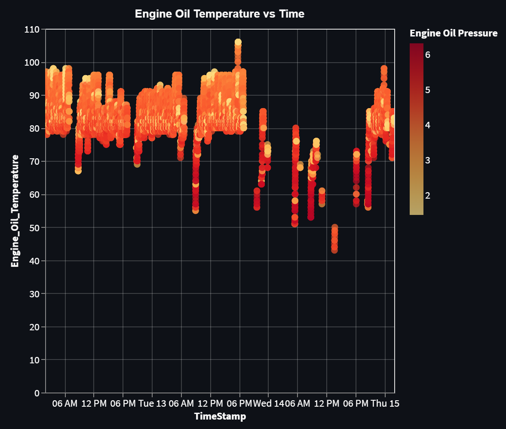
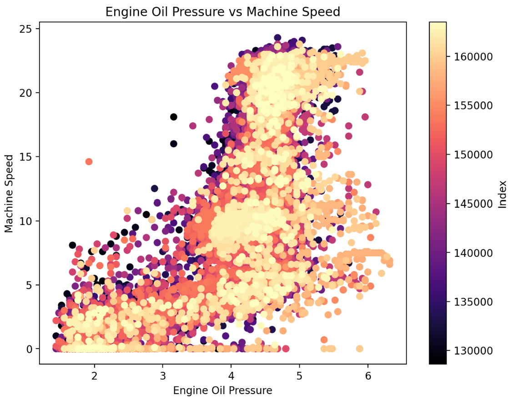
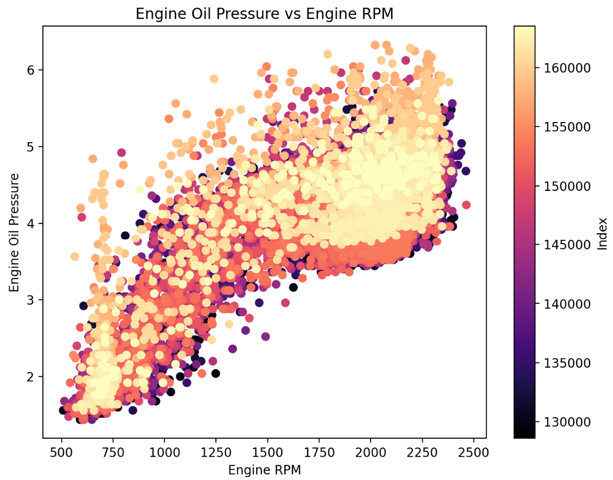
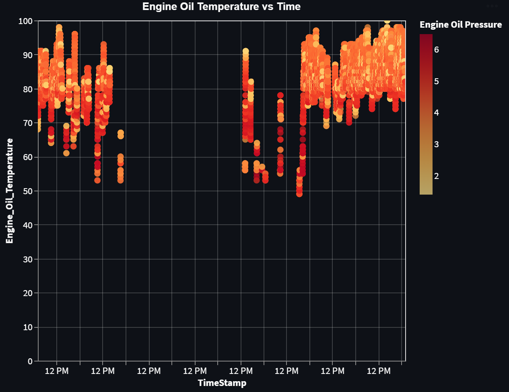
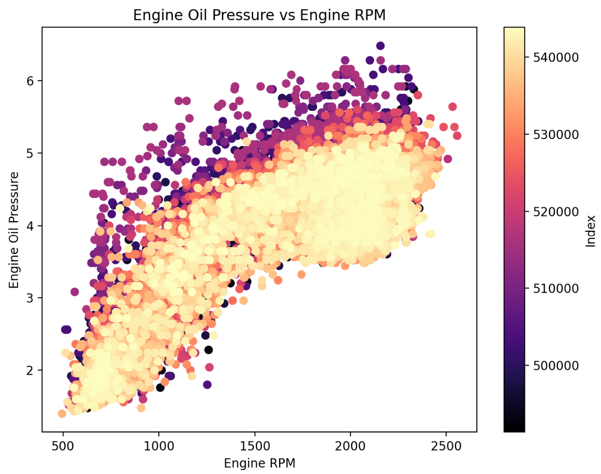

# 🏭 Sensor Data Analysis — Anomaly Detection in Maintenance and Sensor Data

> An interactive Streamlit app for exploring industrial maintenance data and detecting anomalies from sensor readings.

---

## 🚀 About the Project

This project focuses on analyzing industrial sensor data and machine maintenance history to detect anomalies. The application allows users to:

- View maintenance types distribution  
- Identify the longest downtime events  
- Explore sensor variable distributions  
- Detect outliers  
- Analyze correlations between sensor values  
- Filter data by date range and machine status  

---

## 🔧 Technologies Used

- **Python 3.8+**  
- **Streamlit** – interactive app interface  
- **Pandas** – data analysis  
- **Plotly / Seaborn / Matplotlib / Altair** – data visualization  

---

## 📊 Key Features

### 🔹 Maintenance Type Distribution

The app starts by displaying a bar chart of the most frequent maintenance types, helping users quickly identify the dominant service activities.

📌 **Planned maintenance** appears most frequently in the dataset.

---

### 🔹 Focus on Unplanned & Critical Failures

The dataset is filtered to focus only on **unplanned** and **critical** failures, as they are the most relevant for anomaly detection.

### 🔹 Longest Downtime Events

The application highlights the machines with the longest downtime periods. The data is shown in both a table and a horizontal bar chart.

This helps maintenance teams focus on the most severe breakdowns.

**Focus Periods**: We will concentrate on September and October due to the emergence of breakdowns during these months.



### 🔹 Sensor Variable Distribution

Users can select a sensor variable and analyze its distribution across different machine statuses (e.g., "Running", "Stopped") and over specific time ranges.

👉 You can interactively filter by variable and time window to focus the analysis.

---

### 🔹 Outlier Detection

Boxplots allow users to detect outliers in the sensor data. You can filter by machine status and time period to narrow down the conditions under which anomalies appear.

---

### 🔹 Correlation Heatmap

A correlation matrix is generated to show relationships between sensor variables.

✅ This helps to identify which variables might be redundant or informative for anomaly detection.



### 🔹 Trends and Anomalies in Engine Oil Temperature and Pressure
Main Key points (September):

- The graph shows clear, regular patterns of increase and decrease in engine oil temperature and pressure, indicating normal operation.
- Irregular shapes in the sensor data suggest potential anomalies.
- These discrepancies require further investigation to rule out underlying issues affecting engine performance.



Main Key points:

- **Cluster at zero machine speed**: This may indicate sensor malfunctions during the leak, as the machine wasn't idle.
- **Scattered points at low speeds and pressures**: Could reflect inconsistencies or erratic readings during the leak.
- **Outliers at higher pressures**: These may represent pressure fluctuations due to the leakage.



Main Key points:

- **Low RPM with low pressure**: Indicates potential pressure drops caused by the leak.
- **Moderate RPM with high pressure**: Suggests system overcompensation to maintain pressure during the leak.
- **Variability in pressure**: Likely due to pressure instability caused by the leak.



Main Key points (October):

- The graph shows clear, regular patterns of increase and decrease in engine oil temperature and pressure, indicating normal operation.
- Irregular shapes in the sensor data suggest potential anomalies.
- These discrepancies require further investigation to rule out underlying issues affecting engine performance.



Main Key points:

- **Inconsistent Pressure Readings**: Inconsistent oil pressure can signal problems with the brake cooler pump, which may lead to overheating and compromised braking performance.
- **Pressure Spikes**: Sudden spikes in oil pressure at varying RPMs may reflect abnormal load conditions, stressing both the transmission and cooling systems.



## ▶️ How to Run the App

1. Clone the repository:

   ```bash
   git clone https://github.com/yourusername/sensor-anomaly-streamlit.git
   cd sensor-anomaly-streamlit
   ```

2. Install required packages:

   ```bash
   pip install -r requirements.txt
   ```

3. Launch the app:

   ```bash
   streamlit run app.py
   ```

---

## 📂 Project Structure

```
sensor-anomaly-streamlit/
├── app.py                  # Streamlit application
├── data/
│   ├── sensors.csv         # Sensor readings
│   └── maintenance.csv     # Maintenance records
├── requirements.txt        # Python dependencies
└── README.md               # Project description
```

---

## 📌 Notes

- The app is designed for exploratory and educational purposes.  
- Data is assumed to be preprocessed and anonymized.  
- Time ranges and variable selection can be customized in the UI.

---

## 📬 Contact

If you have questions or suggestions, feel free to reach out via [LinkedIn](https://www.linkedin.com/) or open an issue in this repo.

